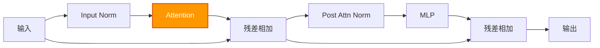
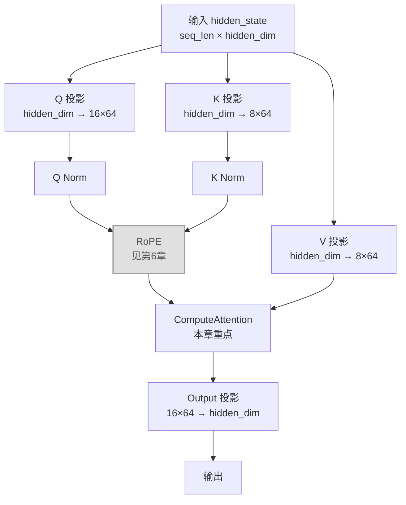

# 第 7 章：Multi-Head Attention（GQA）—— Transformer 的核心

在第 5 章和第 6 章中，我们分别实现了基础算子（Embedding / RMSNorm / Linear）和 RoPE 位置编码。现在这些零件都已备齐，可以组装 Transformer 中最重要的模块了：**Multi-Head Attention（多头注意力）**。

Qwen3 使用的是 **GQA（Grouped Query Attention，分组查询注意力）**，一个 Q head 多、KV head 少的优化变体。

---

## 7.1 Attention 模块概览

### 7.1.1 Attention 在 Decoder Block 中的位置

一个 Transformer Decoder Block 由 Attention + MLP 串联而成：



输入和输出的 shape 不变，都是 `[seq_len, hidden_dim]`。

### 7.1.2 Attention 内部的数据流

把 Attention 方框展开：



前面几章已经覆盖了 Q/K/V 投影（第 5 章的 Linear）、QK Norm（第 5 章的 RMSNorm）、RoPE（第 6 章）。本章聚焦于 **ComputeAttention** 这一步。

### 7.1.3 ComputeAttention 做了什么

输入：Q、K、V 三个张量
输出：一个张量，shape 与 Q 相同

计算步骤：

```
1. 把 Q 按 head 拆分：16 个 head，每个 64 维
2. 把 K、V 按 head 拆分：8 个 head，每个 64 维（GQA）
3. 对于每个 Q head：
   a. 确定对应的 KV head（GQA 映射）
   b. 算 Q·K^T，除以 sqrt(64)，加上因果掩码
   c. Softmax 得到注意力权重
   d. 用权重对 V 加权求和
4. 把所有 head 的输出拼接回来
```

---

## 7.2 多头拆分：一个向量切成多个 head

### 7.2.1 Q、K、V 的 shape

线性投影之后，各张量的 shape 是：

```
Q: [seq_len, num_heads × head_dim]    = [seq_len, 16 × 64] = [seq_len, 1024]
K: [seq_len, num_kv_heads × head_dim] = [seq_len,  8 × 64] = [seq_len,  512]
V: [seq_len, num_kv_heads × head_dim] = [seq_len,  8 × 64] = [seq_len,  512]
```

**注意**：K 和 V 的 head 数量是 8（不是 16）。这就是 GQA 的关键——KV head 更少。

### 7.2.2 在内存中定位某个 head

Q 的 1024 维在内存里是 16 个 head 首尾相接排列的：

```
Q 的一行（1024 维）：
┌──────────────┬──────────────┬─────┬──────────────┐
│   head 0     │   head 1     │ ... │   head 15    │
│   (64 维)    │   (64 维)    │     │   (64 维)    │
└──────────────┴──────────────┴─────┴──────────────┘
 ← 64 个 float →← 64 个 float →     ← 64 个 float →
```

定位到**第 i 个 token、第 h 个 Q head 的第 d 维**：

```cpp
float* q_ptr = q.data<float>() + i * num_heads * head_dim + h * head_dim;
// q_ptr[d] 就是该 head 的第 d 维
```

K 和 V 同理，只是 head 数量用 `num_kv_heads`（8 个）：

```cpp
float* k_ptr = k.data<float>() + j * num_kv_heads * head_dim + kv_h * head_dim;
```

---

## 7.3 GQA：分组查询注意力

### 7.3.1 什么是 GQA

标准 Multi-Head Attention 中，Q、K、V 的 head 数量相同。GQA 做了一个简化：**多个 Q head 共用同一个 KV head**。

Qwen3-0.6B 的配置：

| 参数 | 值 |
|---|---|
| num_heads（Q head 数） | 16 |
| num_kv_heads（KV head 数） | 8 |
| 每个 KV head 对应几个 Q head | 16 / 8 = **2** |

### 7.3.2 映射公式

给定一个 Q head 编号 `h`（0~15），找到对应的 KV head 编号 `kv_h`：

```cpp
kv_h = h / (num_heads / num_kv_heads);
//   = h / (16 / 8)
//   = h / 2
```

**手算对照**：

```
Q head 0 → kv_h = 0/2 = 0  ─┐
Q head 1 → kv_h = 1/2 = 0  ─┤ 共用 KV head 0
                             │
Q head 2 → kv_h = 2/2 = 1  ─┐
Q head 3 → kv_h = 3/2 = 1  ─┤ 共用 KV head 1
                             │
...以此类推...
                             │
Q head 14 → kv_h = 14/2 = 7 ─┐
Q head 15 → kv_h = 15/2 = 7 ─┤ 共用 KV head 7
```

这个映射在代码里只需要一行整数除法。

---

## 7.4 因果掩码（Causal Mask）

### 7.4.1 概念

自回归生成时，第 i 个 token **只能看到它自己和前面的 token**（位置 0~i），不能偷看后面的 token。

这在计算 Attention Score 时，通过把"非法"位置设为 `-inf`（代码中用 `-1e9`）来实现——Softmax 之后，`exp(-1e9) ≈ 0`，那些位置就不会被关注到。

### 7.4.2 注意力矩阵

以 seq_len=3 为例，注意力分数矩阵（行=i 查询，列=j 被查）：

```
        j=0    j=1    j=2
i=0   [score  -inf   -inf  ]     位置 0 只能看自己
i=1   [score  score  -inf  ]     位置 1 能看 0,1
i=2   [score  score  score ]     位置 2 能看全部
```

上三角全是 `-inf`，Softmax 之后全变成 0。

### 7.4.3 代码判断

```cpp
if (j > i + position) {
    attention_scores_data[j] = -1e9;  // 设为负无穷
    continue;                          // 跳过点积计算
}
```

`position` 是 KV Cache 中的偏移（无 cache 时为 0），这里先忽略，第 10 章再展开。

---

## 7.5 注意力分数计算：完整手算

用一个极小例子，一步一步手算 Attention 的全过程。

**设定**：
- seq_len = 2（两个 token）
- num_heads = 1（1 个 Q head）
- num_kv_heads = 1（1 个 KV head）
- head_dim = 2（每个 head 只有 2 维）
- scale = 1/√2 ≈ 0.7071

**输入**：

```
Q = [[1.0, 0.0],      ← token 0 的 query
     [0.0, 1.0]]      ← token 1 的 query

K = [[1.0, 0.0],      ← token 0 的 key
     [1.0, 1.0]]      ← token 1 的 key

V = [[2.0, 0.0],      ← token 0 的 value
     [0.0, 2.0]]      ← token 1 的 value
```

**步骤 1：算 Q·K^T（原始分数）**

```
token 0 作为 query：
  Q₀·K₀ = 1.0×1.0 + 0.0×0.0 = 1.0
  Q₀·K₁ = 1.0×1.0 + 0.0×1.0 = 1.0

token 1 作为 query：
  Q₁·K₀ = 0.0×1.0 + 1.0×0.0 = 0.0
  Q₁·K₁ = 0.0×1.0 + 1.0×1.0 = 1.0

原始分数矩阵：
  [[1.0, 1.0],
   [0.0, 1.0]]
```

**步骤 2：除以 sqrt(head_dim) + 因果掩码**

```
scale = 1/√2 ≈ 0.7071

缩放后：
  [[0.7071, 0.7071],
   [0.0,    0.7071]]

因果掩码（j > i 置 -1e9）：
  [[0.7071, -1e9  ],     ← token 0 不能看 token 1
   [0.0,     0.7071]]    ← token 1 两个都能看
```

**步骤 3：Softmax（每行独立）**

```
token 0:  [0.7071, -1e9]
  exp(0.7071) = 2.028,  exp(-1e9) ≈ 0
  sum = 2.028
  softmax = [2.028/2.028, 0/2.028] = [1.0, 0.0]

token 1:  [0.0, 0.7071]
  exp(0.0) = 1.0,  exp(0.7071) = 2.028
  sum = 1.0 + 2.028 = 3.028
  softmax = [1.0/3.028, 2.028/3.028] = [0.330, 0.670]

注意力权重矩阵：
  [[1.0,   0.0  ],
   [0.330, 0.670]]
```

**步骤 4：加权求和 V**

```
token 0 的输出 = 1.0 × V₀ + 0.0 × V₁
               = 1.0 × [2.0, 0.0] + 0.0 × [0.0, 2.0]
               = [2.0, 0.0]

token 1 的输出 = 0.330 × V₀ + 0.670 × V₁
               = 0.330 × [2.0, 0.0] + 0.670 × [0.0, 2.0]
               = [0.660, 0.0] + [0.0, 1.340]
               = [0.660, 1.340]

最终输出：
  [[2.0,  0.0  ],
   [0.660, 1.340]]
```

这个例子把 Attention 的四步走（点积 → 缩放+掩码 → Softmax → 加权求和）完整过了一遍。

---

## 7.6 代码实现

### 7.6.1 ComputeAttention 函数

```cpp
Tensor ComputeAttention(Tensor& q, Tensor& k, Tensor& v, size_t position = 0) {
    size_t seq_len = q.shape()[0];          // 当前输入 token 数
    float scale = 1.0f / std::sqrt((float)head_dim_);

    // 输出 shape 与 Q 相同：[seq_len, num_heads × head_dim]
    Tensor output({seq_len, num_heads_ * head_dim_}, sizeof(float));

    // 临时存放一行 attention score：[1, position + seq_len]
    Tensor attention_scores({1, position + seq_len}, sizeof(float));

    // 第 1 层：遍历每个 Q head
    for (size_t h = 0; h < num_heads_; ++h) {

        // GQA 映射：找到对应的 KV head
        size_t kv_h = h / (num_heads_ / num_kv_heads_);

        // 第 2 层：遍历每个 query 位置
        for (size_t i = 0; i < seq_len; ++i) {

            // 第 3 层：遍历每个 key 位置（含 cache 中的历史 token）
            float* scores = attention_scores.data<float>();
            for (size_t j = 0; j < position + seq_len; ++j) {

                // 因果掩码：不能看未来
                if (j > i + position) {
                    scores[j] = -1e9f;
                    continue;
                }

                // 第 4 层：计算 Q·K 点积
                float dot = 0.0f;
                float* q_ptr = q.data<float>()
                    + i * num_heads_ * head_dim_ + h * head_dim_;
                float* k_ptr = k.data<float>()
                    + j * num_kv_heads_ * head_dim_ + kv_h * head_dim_;

                for (int d = 0; d < head_dim_; ++d) {
                    dot += q_ptr[d] * k_ptr[d];
                }
                scores[j] = dot * scale;   // 除以 sqrt(head_dim)
            }

            // Softmax（第 5 章实现的 SoftMax::Forward）
            SoftMax::Forward(attention_scores);

            // 加权求和 V：output = Σ attention_weight × V
            float* out_ptr = output.data<float>()
                + i * num_heads_ * head_dim_ + h * head_dim_;
            memset(out_ptr, 0, head_dim_ * sizeof(float));

            for (size_t j = 0; j < position + seq_len; ++j) {
                float weight = scores[j];
                float* v_ptr = v.data<float>()
                    + j * num_kv_heads_ * head_dim_ + kv_h * head_dim_;
                for (int d = 0; d < head_dim_; ++d) {
                    out_ptr[d] += weight * v_ptr[d];
                }
            }
        }
    }
    return output;
}
```

### 7.6.2 逐段解释

**四层循环的含义**：

```
for h in 0..15:           ← 每个 Q head 独立计算
    kv_h = h / 2          ← GQA 映射（一行整数除法）
    for i in 0..seq_len:  ← 每个 query 位置
        for j in 0..总长:  ← 每个 key 位置（含历史）
            算 Q_i · K_j × scale + causal_mask
        Softmax 整行
        for j in 0..总长:  ← 加权求和 V
            output[i,h] += weight[j] × V[j, kv_h]
```

**因果掩码的判断**（第 7.4 节）：

```cpp
if (j > i + position) {
    scores[j] = -1e9f;
    continue;
}
```

- 没有 KV Cache 时，position=0，条件退化为 `j > i`
- j > i 意味着 key 的位置在 query 之后 → 设为 -1e9，Softmax 后权重为零

**GQA 映射**（第 7.3 节）：

```cpp
size_t kv_h = h / (num_heads_ / num_kv_heads_);
```

Q head 0,1 → KV head 0；Q head 2,3 → KV head 1；以此类推。

**点积**：

```cpp
float dot = 0.0f;
for (int d = 0; d < head_dim_; ++d) {
    dot += q_ptr[d] * k_ptr[d];
}
scores[j] = dot * scale;
```

head_dim 维向量的内积，然后乘以 `1/√head_dim`（论文中的缩放因子，防止内积过大导致 Softmax 梯度消失）。

**加权求和**：

```cpp
memset(out_ptr, 0, head_dim_ * sizeof(float));
for (size_t j = 0; j < position + seq_len; ++j) {
    float weight = scores[j];
    for (int d = 0; d < head_dim_; ++d) {
        out_ptr[d] += weight * v_ptr[d];
    }
}
```

用 Softmax 得到的注意力权重，对 V 做加权平均。结果写入 output 的对应 head。

---

## 7.7 完整代码：Attention 类

```cpp
class Attention {
public:
    Attention(size_t hidden_dim, size_t num_kv_heads,
              size_t num_heads, size_t head_dim)
        : hidden_dim_(hidden_dim)
        , num_heads_(num_heads)
        , num_kv_heads_(num_kv_heads)
        , head_dim_(head_dim) {

        // Q/K/V 线性投影
        q_proj_ = std::make_shared<LinearProjection>(
            hidden_dim_, num_heads_ * head_dim_);
        k_proj_ = std::make_shared<LinearProjection>(
            hidden_dim_, num_kv_heads_ * head_dim_);
        v_proj_ = std::make_shared<LinearProjection>(
            hidden_dim_, num_kv_heads_ * head_dim_);

        // Output 投影
        output_proj_ = std::make_shared<LinearProjection>(
            num_heads_ * head_dim_, hidden_dim_);

        // QK 归一化（Qwen3 特有）
        q_norm_ = std::make_shared<RMSNorm>(head_dim_);
        k_norm_ = std::make_shared<RMSNorm>(head_dim_);
    }

    Tensor Forward(Tensor& input, size_t position = 0) {
        // 1. 线性投影
        Tensor q = q_proj_->Forward(input);
        Tensor k = k_proj_->Forward(input);
        Tensor v = v_proj_->Forward(input);

        // 2. QK 归一化
        q = q_norm_->Forward(q);
        k = k_norm_->Forward(k);

        // 3. RoPE（见第 6 章）
        ApplyRoPE(q, k, position);

        // 4. 计算 Attention（本章核心）
        Tensor attn_output = ComputeAttention(q, k, v, position);

        // 5. Output 投影：拼回 hidden_dim
        attn_output = output_proj_->Forward(attn_output);

        return attn_output;
    }

private:
    // ApplyRoPE: 见第 6 章
    // ComputeAttention: 见 7.6 节

    size_t hidden_dim_;
    size_t num_heads_;       // 16
    size_t num_kv_heads_;    // 8
    size_t head_dim_;        // 64

    std::shared_ptr<RMSNorm> q_norm_;
    std::shared_ptr<RMSNorm> k_norm_;
    std::shared_ptr<LinearProjection> q_proj_;
    std::shared_ptr<LinearProjection> k_proj_;
    std::shared_ptr<LinearProjection> v_proj_;
    std::shared_ptr<LinearProjection> output_proj_;
};
```

**Forward 流程回顾**（对照 7.1.2 的 Mermaid 图）：

| 步骤 | 操作 | shape 变化 |
|---|---|---|
| 1 | Q 投影 | `[seq_len, 1024]` → `[seq_len, 1024]`（16×64） |
| 1 | K/V 投影 | `[seq_len, 1024]` → `[seq_len, 512]`（8×64） |
| 2 | QK Norm | 不变 |
| 3 | RoPE | 不变（原地旋转） |
| 4 | ComputeAttention | `[seq_len, 1024]`（16 heads 各自算完拼回） |
| 5 | Output 投影 | `[seq_len, 1024]` → `[seq_len, 1024]` |

---

## 7.8 测试与验证

### 7.8.1 创建测试文件

新建 `test/test_attention.cpp`：

```cpp
#include <cmath>
#include <cstring>
#include <iomanip>
#include <iostream>

#include "tensor.h"

// 简化版 SoftMax（复用第 5 章的实现）
void SoftMax(float* row, int len) {
    float max_val = row[0];
    for (int i = 1; i < len; ++i) {
        if (row[i] > max_val) max_val = row[i];
    }
    float sum = 0.0f;
    for (int i = 0; i < len; ++i) {
        row[i] = std::exp(row[i] - max_val);
        sum += row[i];
    }
    for (int i = 0; i < len; ++i) {
        row[i] /= sum;
    }
}

// 简化版 ComputeAttention（不依赖完整 Attention 类，便于独立测试）
Tensor ComputeAttention(Tensor& q, Tensor& k, Tensor& v,
                        int num_heads, int num_kv_heads,
                        int head_dim, size_t position = 0) {
    size_t seq_len = q.shape()[0];
    float scale = 1.0f / std::sqrt((float)head_dim);
    Tensor output({seq_len, (size_t)(num_heads * head_dim)}, sizeof(float));

    for (int h = 0; h < num_heads; ++h) {
        int kv_h = h / (num_heads / num_kv_heads);

        for (size_t i = 0; i < seq_len; ++i) {
            // 分配 score 数组
            size_t total_len = position + seq_len;
            float* scores = new float[total_len];

            for (size_t j = 0; j < total_len; ++j) {
                if (j > i + position) {
                    scores[j] = -1e9f;
                    continue;
                }
                float dot = 0.0f;
                float* q_ptr = q.data<float>()
                    + i * num_heads * head_dim + h * head_dim;
                float* k_ptr = k.data<float>()
                    + j * num_kv_heads * head_dim + kv_h * head_dim;
                for (int d = 0; d < head_dim; ++d) {
                    dot += q_ptr[d] * k_ptr[d];
                }
                scores[j] = dot * scale;
            }

            SoftMax(scores, total_len);

            float* out_ptr = output.data<float>()
                + i * num_heads * head_dim + h * head_dim;
            memset(out_ptr, 0, head_dim * sizeof(float));
            for (size_t j = 0; j < total_len; ++j) {
                float* v_ptr = v.data<float>()
                    + j * num_kv_heads * head_dim + kv_h * head_dim;
                for (int d = 0; d < head_dim; ++d) {
                    out_ptr[d] += scores[j] * v_ptr[d];
                }
            }
            delete[] scores;
        }
    }
    return output;
}

void PrintMatrix(const char* label, Tensor& t, int rows, int cols) {
    float* data = t.data<float>();
    std::cout << label << ":" << std::endl;
    for (int i = 0; i < rows; ++i) {
        std::cout << "  [";
        for (int j = 0; j < cols; ++j) {
            std::cout << std::fixed << std::setprecision(4) << data[i * cols + j];
            if (j < cols - 1) std::cout << ", ";
        }
        std::cout << "]" << std::endl;
    }
}

int main() {
    int num_heads = 1;
    int num_kv_heads = 1;
    int head_dim = 2;

    std::cout << "=== 测试 1：对照 7.5 节手算结果 ===" << std::endl;
    std::cout << "(seq_len=2, num_heads=1, head_dim=2, position=0)" << std::endl;
    std::cout << std::endl;

    {
        Tensor q({2, 2}, sizeof(float));
        Tensor k({2, 2}, sizeof(float));
        Tensor v({2, 2}, sizeof(float));

        float* qd = q.data<float>();
        float* kd = k.data<float>();
        float* vd = v.data<float>();

        // 7.5 节的输入数据
        qd[0]=1.0f; qd[1]=0.0f; qd[2]=0.0f; qd[3]=1.0f;
        kd[0]=1.0f; kd[1]=0.0f; kd[2]=1.0f; kd[3]=1.0f;
        vd[0]=2.0f; vd[1]=0.0f; vd[2]=0.0f; vd[3]=2.0f;

        PrintMatrix("Q", q, 2, 2);
        PrintMatrix("K", k, 2, 2);
        PrintMatrix("V", v, 2, 2);

        Tensor output = ComputeAttention(q, k, v, num_heads, num_kv_heads, head_dim);

        PrintMatrix("输出", output, 2, 2);
        std::cout << "(7.5 节预期: [[2.0, 0.0], [0.660, 1.340]])" << std::endl;
    }

    std::cout << std::endl;
    std::cout << "=== 测试 2：验证因果掩码 ===" << std::endl;
    std::cout << "(token 0 不能关注 token 1，注意力权重应为 0)" << std::endl;
    std::cout << std::endl;

    {
        // 用 7.5 节同样的输入，打印 Softmax 后的注意力权重
        Tensor q({2, 2}, sizeof(float));
        Tensor k({2, 2}, sizeof(float));
        Tensor v({2, 2}, sizeof(float));

        float* qd = q.data<float>();
        float* kd = k.data<float>();
        float* vd = v.data<float>();

        qd[0]=1.0f; qd[1]=0.0f; qd[2]=0.0f; qd[3]=1.0f;
        kd[0]=1.0f; kd[1]=0.0f; kd[2]=1.0f; kd[3]=1.0f;
        vd[0]=2.0f; vd[1]=0.0f; vd[2]=0.0f; vd[3]=2.0f;

        // 手工算一遍 attention weights 并输出
        float scale = 1.0f / std::sqrt(2.0f);
        for (int i = 0; i < 2; ++i) {
            float scores[2];
            for (int j = 0; j < 2; ++j) {
                if (j > i) {
                    scores[j] = -1e9f;
                } else {
                    float dot = 0.0f;
                    for (int d = 0; d < 2; ++d) {
                        dot += qd[i*2+d] * kd[j*2+d];
                    }
                    scores[j] = dot * scale;
                }
            }
            SoftMax(scores, 2);
            std::cout << "token " << i << " 的注意力权重: ["
                      << std::fixed << std::setprecision(4)
                      << scores[0] << ", " << scores[1] << "]";
            if (i == 0) {
                std::cout << "  ← scores[1] 应为 0（被 mask）";
            }
            std::cout << std::endl;
        }
    }

    std::cout << std::endl;
    std::cout << "=== 测试 3：验证 GQA 映射 ===" << std::endl;
    std::cout << "(num_heads=6, num_kv_heads=2, 每 3 个 Q head 共用 1 个 KV head)" << std::endl;
    std::cout << std::endl;

    {
        int nh = 6, nkh = 2;
        for (int h = 0; h < nh; ++h) {
            int kv_h = h / (nh / nkh);
            std::cout << "Q head " << h << " → KV head " << kv_h << std::endl;
        }
        std::cout << "(预期: 0,1,2→0; 3,4,5→1)" << std::endl;
    }

    std::cout << std::endl;
    std::cout << "所有测试完成！" << std::endl;
    return 0;
}
```

### 7.8.2 更新 CMakeLists.txt

```cmake
# Attention 测试
add_executable(test_attention test/test_attention.cpp)
target_include_directories(test_attention PRIVATE
    ${CMAKE_CURRENT_SOURCE_DIR}/src
)
```

### 7.8.3 编译并运行

```bash
cd build
cmake ..
make test_attention
./test_attention
```

**预期输出**：

```
=== 测试 1：对照 7.5 节手算结果 ===
(seq_len=2, num_heads=1, head_dim=2, position=0)

Q:
  [1.0000, 0.0000]
  [0.0000, 1.0000]
K:
  [1.0000, 0.0000]
  [1.0000, 1.0000]
V:
  [2.0000, 0.0000]
  [0.0000, 2.0000]
输出:
  [2.0000, 0.0000]
  [0.6600, 1.3400]
(7.5 节预期: [[2.0, 0.0], [0.660, 1.340]])

=== 测试 2：验证因果掩码 ===
(token 0 不能关注 token 1，注意力权重应为 0)

token 0 的注意力权重: [1.0000, 0.0000]  ← scores[1] 应为 0（被 mask）
token 1 的注意力权重: [0.3300, 0.6700]

=== 测试 3：验证 GQA 映射 ===
(num_heads=6, num_kv_heads=2, 每 3 个 Q head 共用 1 个 KV head)

Q head 0 → KV head 0
Q head 1 → KV head 0
Q head 2 → KV head 0
Q head 3 → KV head 1
Q head 4 → KV head 1
Q head 5 → KV head 1
(预期: 0,1,2→0; 3,4,5→1)

所有测试完成！
```

---

## 7.9 小结

本章实现了 Multi-Head Attention（GQA），核心步骤：

1. **多头拆分**：Q 切成 16 个 head（每个 64 维），K/V 切成 8 个 head
2. **GQA 映射**：`kv_h = h / (num_heads / num_kv_heads)`，2 个 Q head 共用 1 个 KV head
3. **因果掩码**：`j > i` 的位置设为 `-1e9`
4. **Score 计算**：Q·K^T / √head_dim → Softmax → 加权求和 V
5. **Output 投影**：拼回 hidden_dim

这是整个 Transformer 中最复杂、也是最重要的模块。下一章，我们将把 Attention、MLP、RMSNorm 串成一个完整的 **Decoder Block**，并实现 **Qwen3Model** 的加载与前向传播。
