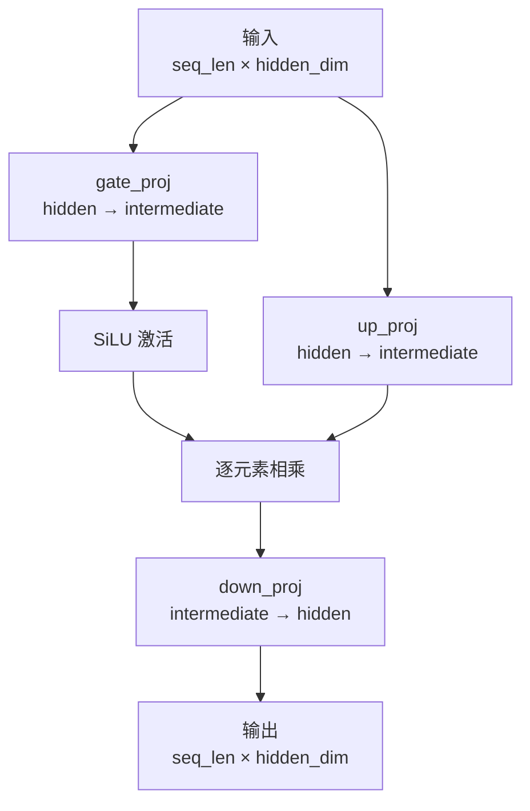

# 第 8 章：MLP —— SwiGLU 前馈网络

在前几章，我们实现了 Attention 机制（第 7 章），它负责让 token 之间互相"交流"信息。但在 Transformer 中，每个 Decoder Block 实际上由两部分组成：

```
input → [Attention] → [MLP] → output
```

Attention 处理的是 **token 之间的关系**（跨位置），MLP 处理的是 **单个 token 内部的非线性变换**（逐位置）。两者互补，缺一不可。

这一章，我们实现 Qwen3 使用的 MLP 变体：**SwiGLU**。

---

## 8.1 MLP 在 Decoder 中的位置

回顾一个 Decoder Block 的结构：

```
       ┌──→ input_norm → Attention ──┐
       │                             ↓
input ─┤                         残差相加(+) ──→ post_attn_norm → MLP ──→ 残差相加(+) → output
       └────────────────────────────────────────┘              └─────────────────────┘
```

Attention 完成后，经过残差连接和 post_attention_norm，数据进入 MLP。

---

## 8.2 SwiGLU 的结构

普通 MLP 只有两条投影：一个升维 + 激活，一个降维回去。SwiGLU 多了一条——用**门控机制**控制信息流动：



**计算步骤**：

1. `up = input × up_proj` — 信息通道
2. `gate = SiLU(input × gate_proj)` — 门控通道（0~1 之间的值）
3. `merged = up ⊙ gate` — 门控：gate 决定 up 的哪些信息通过
4. `output = merged × down_proj` — 降维回去

三条投影的维度（Qwen3-0.6B）：

| 投影 | 输入 → 输出 | shape |
|---|---|---|
| up_proj | 1024 → 2816 | [1024, 2816] |
| gate_proj | 1024 → 2816 | [1024, 2816] |
| down_proj | 2816 → 1024 | [2816, 1024] |

中间维度 2816 大约是 hidden_dim 的 2.75 倍——升维给模型更大的变换空间，然后再压回去。

---

## 8.3 SiLU 激活函数

门控通道用 SiLU（Sigmoid Linear Unit），也叫 Swish：

```
SiLU(x) = x × sigmoid(x)
        = x / (1 + e^(-x))
```

**图像特点**：
- x > 0：接近 x（类似 identity）
- x < 0：轻微负值，不会像 ReLU 那样直接截断为 0
- 整体平滑，处处可导

**手算两个值**：

x = 2.0：

```
sigmoid(2.0) = 1 / (1 + 0.1353) = 0.8808
SiLU(2.0)    = 2.0 × 0.8808    = 1.7616
```

x = -1.0：

```
sigmoid(-1.0) = 1 / (1 + 2.718) = 0.2689
SiLU(-1.0)    = -1.0 × 0.2689   = -0.2689
```

SiLU 的导数在反向传播中更平滑，训练时比 ReLU 更稳定。

---

## 8.4 完整手算示例

用一个极小例子走通 SwiGLU 的全过程。

**设定**：hidden_dim=3, intermediate=4, seq_len=1

**权重**（全 1.0，方便手算）：

```
up_proj:   [3×4]  全 1.0
gate_proj: [3×4]  全 1.0
down_proj: [4×3]  全 1.0
```

**输入**：`[2.0, 0.0, -1.0]`（1 个 token，3 维）

**步骤 1**：up = input × up_proj

```
up[j] = Σ input[i] × up_proj[i,j] = 2.0 + 0.0 + (-1.0) = 1.0
up = [1.0, 1.0, 1.0, 1.0]
```

**步骤 2**：gate_raw = input × gate_proj，然后过 SiLU

```
gate_raw = [1.0, 1.0, 1.0, 1.0]   （计算同上）

SiLU(1.0) = 1.0 × sigmoid(1.0) = 1.0 × 0.7311 = 0.7311

gate = [0.7311, 0.7311, 0.7311, 0.7311]
```

**步骤 3**：merged = up ⊙ gate（逐元素乘）

```
merged[j] = 1.0 × 0.7311 = 0.7311
merged = [0.7311, 0.7311, 0.7311, 0.7311]
```

**步骤 4**：output = merged × down_proj

```
output[k] = Σ merged[j] × down_proj[j,k] = 0.7311 × 4 = 2.9244
output = [2.9244, 2.9244, 2.9244]
```

输入 3 维、输出 3 维，中间在 4 维空间做了一次非线性变换（门控 + 升维）。

---

## 8.5 代码实现

```cpp
class MLP {
public:
    MLP(size_t hidden_size, size_t intermediate_size)
        : intermediate_size_(intermediate_size) {
        up_proj_   = std::make_shared<LinearProjection>(
            hidden_size, intermediate_size);
        gate_proj_ = std::make_shared<LinearProjection>(
            hidden_size, intermediate_size);
        down_proj_ = std::make_shared<LinearProjection>(
            intermediate_size, hidden_size);
    }

    void Forward(Tensor& input, Tensor& output) {
        // input:  [seq_len, hidden_dim]
        // up:     [seq_len, intermediate_size]
        // gate:   [seq_len, intermediate_size]
        Tensor up   = up_proj_->Forward(input);
        Tensor gate = gate_proj_->Forward(input);

        size_t seq_len = input.shape()[0];

        // 对每个 token：SiLU(gate) × up，逐元素
        for (size_t i = 0; i < seq_len; ++i) {
            float* up_ptr   = up.data<float>()
                            + i * intermediate_size_;
            float* gate_ptr = gate.data<float>()
                            + i * intermediate_size_;

            for (size_t j = 0; j < intermediate_size_; ++j) {
                // SiLU: x * sigmoid(x) = x / (1 + exp(-x))
                float silu_val = gate_ptr[j]
                               / (1.0f + std::exp(-gate_ptr[j]));
                up_ptr[j] = silu_val * up_ptr[j];
            }
        }

        // down_proj: [seq_len, intermediate] → [seq_len, hidden_dim]
        output = down_proj_->Forward(up);
    }

private:
    std::shared_ptr<LinearProjection> up_proj_;
    std::shared_ptr<LinearProjection> gate_proj_;
    std::shared_ptr<LinearProjection> down_proj_;
    size_t intermediate_size_;
};
```

**代码要点**：

1. **三条投影**：`up_proj_` 和 `gate_proj_` 维度相同，各自独立学习权重
2. **门控写回**：`SiLU(gate) × up` 的结果直接写入 `up` 的内存，省一个中间张量
3. **降维**：最后 `down_proj_->Forward(up)` 把 intermediate 维压回 hidden 维
4. **seq_len 无关**：MLP 对每个 token 独立操作，没有跨位置的交互

---

## 8.6 完整代码

MLP 类放在 `operator.hpp` 中，和 Attention、Decoder 共享同一个文件：

```cpp
// ==================== operator.hpp（MLP 部分）====================
class MLP {
public:
    MLP(size_t hidden_size, size_t intermediate_size);

    void Forward(Tensor& input, Tensor& output);

    // 权重（由 Qwen3Model::Load 填入）
    std::shared_ptr<LinearProjection> up_proj_;
    std::shared_ptr<LinearProjection> gate_proj_;
    std::shared_ptr<LinearProjection> down_proj_;

private:
    size_t intermediate_size_;
};
```

---

## 8.7 测试与验证

### 8.7.1 创建测试文件

新建 `test/test_mlp.cpp`：

```cpp
#include <cmath>
#include <iomanip>
#include <iostream>

#include "tensor.h"
#include "operator.hpp"

int main() {
    std::cout << "=== 测试 1：对照 8.4 节手算结果 ===" << std::endl;
    std::cout << "(hidden=3, intermediate=4, 权重全 1.0)" << std::endl;
    std::cout << std::endl;

    {
        size_t hidden = 3, intermediate = 4;
        MLP mlp(hidden, intermediate);

        // 手工填权重（全 1.0）
        float* up_w   = mlp.up_proj_->weight_.data<float>();
        float* gate_w = mlp.gate_proj_->weight_.data<float>();
        float* down_w = mlp.down_proj_->weight_.data<float>();
        for (size_t i = 0; i < hidden * intermediate; ++i) {
            up_w[i] = 1.0f;
            gate_w[i] = 1.0f;
        }
        for (size_t i = 0; i < intermediate * hidden; ++i) {
            down_w[i] = 1.0f;
        }

        Tensor input({1, hidden}, sizeof(float));
        float* in = input.data<float>();
        in[0] = 2.0f; in[1] = 0.0f; in[2] = -1.0f;

        Tensor output({1, hidden}, sizeof(float));
        mlp.Forward(input, output);

        float* out = output.data<float>();
        std::cout << "输入:  [2.0, 0.0, -1.0]" << std::endl;
        std::cout << "输出:  ["
                  << std::fixed << std::setprecision(4)
                  << out[0] << ", " << out[1] << ", " << out[2] << "]"
                  << std::endl;
        std::cout << "(预期: [2.9244, 2.9244, 2.9244])" << std::endl;
    }

    std::cout << std::endl;
    std::cout << "=== 测试 2：验证 SiLU ===" << std::endl;
    std::cout << std::endl;

    {
        auto silu = [](float x) { return x / (1.0f + std::exp(-x)); };

        std::cout << std::fixed << std::setprecision(4);
        std::cout << "SiLU( 2.0) = " << silu(2.0f)
                  << "  (预期: 1.7616)" << std::endl;
        std::cout << "SiLU( 0.0) = " << silu(0.0f)
                  << "  (预期: 0.0)" << std::endl;
        std::cout << "SiLU(-1.0) = " << silu(-1.0f)
                  << "  (预期: -0.2689)" << std::endl;
    }

    std::cout << std::endl;
    std::cout << "=== 测试 3：seq_len > 1 ===" << std::endl;
    std::cout << "(MLP 对每个 token 独立操作，互不影响)" << std::endl;
    std::cout << std::endl;

    {
        size_t hidden = 2, intermediate = 4;
        MLP mlp(hidden, intermediate);

        // 填 0.0 权重 → 输出为 0，便于验证 shape
        float* up_w   = mlp.up_proj_->weight_.data<float>();
        float* gate_w = mlp.gate_proj_->weight_.data<float>();
        float* down_w = mlp.down_proj_->weight_.data<float>();
        for (size_t i = 0; i < hidden * intermediate; ++i) {
            up_w[i] = 0.0f; gate_w[i] = 0.0f;
        }
        for (size_t i = 0; i < intermediate * hidden; ++i) {
            down_w[i] = 0.0f;
        }

        Tensor input({3, hidden}, sizeof(float));  // 3 个 token
        Tensor output({3, hidden}, sizeof(float));
        mlp.Forward(input, output);

        std::cout << "input shape:  [" << input.shape()[0]
                  << ", " << input.shape()[1] << "]" << std::endl;
        std::cout << "output shape: [" << output.shape()[0]
                  << ", " << output.shape()[1] << "]" << std::endl;
        std::cout << "(预期: [3, 2])" << std::endl;
    }

    std::cout << std::endl;
    std::cout << "所有测试完成！" << std::endl;
    return 0;
}
```

### 8.7.2 更新 CMakeLists.txt

```cmake
# MLP 测试
add_executable(test_mlp test/test_mlp.cpp)
target_include_directories(test_mlp PRIVATE
    ${CMAKE_CURRENT_SOURCE_DIR}/src
    ${CMAKE_CURRENT_SOURCE_DIR}/thirdparty)
target_link_libraries(test_mlp PRIVATE Boost::regex)
```

### 8.7.3 编译运行

```bash
cd build
cmake ..
make test_mlp
./test_mlp
```

**预期输出**：

```
=== 测试 1：对照 8.4 节手算结果 ===
(hidden=3, intermediate=4, 权重全 1.0)

输入:  [2.0, 0.0, -1.0]
输出:  [2.9244, 2.9244, 2.9244]
(预期: [2.9244, 2.9244, 2.9244])

=== 测试 2：验证 SiLU ===

SiLU( 2.0) = 1.7616  (预期: 1.7616)
SiLU( 0.0) = 0.0000  (预期: 0.0)
SiLU(-1.0) = -0.2689  (预期: -0.2689)

=== 测试 3：seq_len > 1 ===
(MLP 对每个 token 独立操作，互不影响)

input shape:  [3, 2]
output shape: [3, 2]
(预期: [3, 2])

所有测试完成！
```

---

## 8.8 小结

本章实现了 SwiGLU 前馈网络：

1. **三条投影**：up_proj（信息） + gate_proj（门控） + down_proj（还原）
2. **SiLU 门控**：`gate = SiLU(input × gate_proj)`，然后 `up ⊙ gate`，让模型学会选择性通过信息
3. **逐位置操作**：MLP 没有跨 token 交互，比 Attention 简单得多

MLP 和 Attention 一起构成了 Decoder Block 的两大组件。下一章，我们将把它们串成完整的 **Decoder Block**，并组装出 **Qwen3Model**，加载 saftensors 权重文件。
