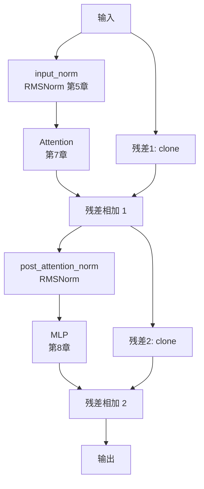

# 第 9 章：模型集成 —— 组装 Qwen3 推理引擎

前几章我们逐一实现了推理引擎的所有零件：Tensor（第 3 章）、Tokenizer（第 4 章）、Embedding / RMSNorm / Linear（第 5 章）、RoPE（第 6 章）、Multi-Head Attention（第 7 章）、MLP（第 8 章）。这一章，我们把它们全部组装起来，得到一个能加载权重、能跑前向传播的完整模型。

---

## 9.1 模型总览

回顾第 1 章的架构图——我们已经完成了哪些？还差哪些？


- 绿色：已实现
- 橙色：Transformer Blocks —— 本章组装

每个 Transformer Block 的结构（Pre-Norm + 残差连接）：

```
       ┌──→ input_norm → Attention ──┐
       │                             ↓
input ─┤                         残差相加(+) ──→ post_attn_norm → MLP ──→ 残差相加(+) → output
       └────────────────────────────────────────┘              └─────────────────────┘
```

Attention（第 7 章）和 MLP（第 8 章）都已经完成。本章把它们装进 **Decoder Block**，28 层串成 **Qwen3Model**，并加载 safetensors 权重。

---

## 9.2 Decoder Block：Attention + MLP 的组合

### 9.2.1 结构

一个 Decoder Block 是 Transformer 的**基本重复单元**：



两个关键模式：
1. **Pre-Norm**：先归一化，再做 Attention / MLP（而非先计算再归一化）
2. **残差连接**：输入跨过 Attention / MLP，直接和输出相加，缓解深层网络退化

### 9.2.2 代码实现

```cpp
class Decoder {
public:
    using Ptr = std::shared_ptr<Decoder>;

    Decoder(size_t hidden_dim, size_t num_kv_heads,
            size_t num_heads, size_t head_dim,
            size_t intermediate_size)
        : hidden_dim_(hidden_dim) {

        // 两个 RMSNorm
        input_norm_  = std::make_shared<RMSNorm>(hidden_dim_);
        post_attention_norm_ = std::make_shared<RMSNorm>(hidden_dim_);

        // Attention（第 7 章）和 MLP（第 8 章）
        attention_ = std::make_shared<Attention>(
            hidden_dim_, num_kv_heads, num_heads, head_dim);
        mlp_ = std::make_shared<MLP>(hidden_dim_, intermediate_size);
    }

    Tensor Forward(Tensor& input, size_t position = 0) {
        // input: [seq_len, hidden_dim]

        // --- Attention 部分 ---
        Tensor residual = input.clone();
        Tensor hidden_states = input_norm_->Forward(input);
        hidden_states = attention_->Forward(hidden_states, position);
        hidden_states = residual + hidden_states;     // 残差相加 1

        // --- MLP 部分 ---
        residual = hidden_states.clone();
        hidden_states = post_attention_norm_->Forward(hidden_states);
        mlp_->Forward(hidden_states, hidden_states);   // 原地写入
        hidden_states = residual + hidden_states;      // 残差相加 2

        return hidden_states;
    }

    void ClearCache() { attention_->ClearCache(); }

    // 权重成员（由 Qwen3Model::Load 填入）
    std::shared_ptr<RMSNorm>  input_norm_;
    std::shared_ptr<Attention> attention_;
    std::shared_ptr<RMSNorm>  post_attention_norm_;
    std::shared_ptr<MLP>      mlp_;

private:
    size_t hidden_dim_;
};
```

**残差连接为什么用 clone？**

因为 `operator+` 会分配新内存。做完第一次残差加法后 `residual` 要保存当前值给第二次残差用，所以先 clone 再覆盖：

```
Step:   residual = A          residual + hidden = C         residual = C.clone()         ...
         ↘ hidden = B        /                             ↘
                            C
```

---

## 9.3 Qwen3Model：全模型组装

### 9.3.1 整体结构

```
输入 Token IDs [seq_len]
    │
    ▼
┌──────────────┐
│  Embedding    │  第5章, [seq_len, 1024]
└──────────────┘
    │
    ▼
┌──────────────┐
│  Decoder 0   │  [seq_len, 1024]
└──────────────┘
    │
    ▼
┌──────────────┐
│  Decoder 1   │  [seq_len, 1024]
└──────────────┘
    │
    ▼   ... × 28 层
    │
    ▼
┌──────────────┐
│  final_norm   │  RMSNorm, [seq_len, 1024]
└──────────────┘
    │
    ▼
┌──────────────┐
│  lm_head      │  Linear: 1024 → 151936, [seq_len, 151936]
└──────────────┘
    │
    ▼
┌──────────────┐
│  Softmax      │  概率分布, [seq_len, 151936]
└──────────────┘
    │
    ▼
  输出 logits
```

### 9.3.2 Forward 代码

```cpp
Tensor Qwen3Model::Forward(const std::vector<uint32_t>& token_ids,
                           size_t position) {
    // 1. Embedding：Token IDs → 向量
    Tensor hidden_state = embedding_->Forward(token_ids);
    // hidden_state: [seq_len, hidden_dim]

    // 2. 逐层过 Decoder（28 层）
    for (size_t i = 0; i < decoders_.size(); ++i) {
        hidden_state = decoders_[i]->Forward(hidden_state, position);
    }

    // 3. 最终归一化
    hidden_state = final_norms_->Forward(hidden_state);

    // 4. LM Head：hidden_dim → vocab_size
    Tensor logits = lm_head_->Forward(hidden_state);
    // logits: [seq_len, vocab_size]

    // 5. Softmax
    SoftMax::Forward(logits);

    return logits;
}
```

**position 参数**：用于 KV Cache（第 11 章），没有 cache 时始终传 0。

### 9.3.3 成员变量一览

```cpp
class Qwen3Model {
public:
    bool Load(const std::string& model_path);
    Tensor Forward(const std::vector<uint32_t>& token_ids, size_t position = 0);
    void ClearCache();

private:
    // 模型组件
    Embedding::Ptr embedding_;             // [151936, 1024]
    std::vector<Decoder::Ptr> decoders_;   // 28 层
    std::shared_ptr<RMSNorm> final_norms_; // 最后一层 RMSNorm
    std::shared_ptr<LinearProjection> lm_head_;  // 1024 → 151936

    // 权重加载辅助
    std::map<std::string, HeaderInfo> headers_;
    size_t data_offset_;
};
```

Qwen3-0.6B 的具体参数：

| 参数 | 值 |
|---|---|
| vocab_size | 151936 |
| hidden_dim | 1024 |
| num_heads | 16 |
| num_kv_heads | 8 |
| head_dim | 64 |
| intermediate_size | 2816 |
| num_hidden_layers | 28 |

---

## 9.4 权重加载：safetensors 格式

### 9.4.1 safetensors 文件结构

模型权重存储在 `model.safetensors` 中。文件布局：

```
┌──────────────────┬───────────────────────┬──────────────────────────────┐
│  header_len      │  JSON header          │  二进制权重数据               │
│  (8 字节, uint64) │  (header_len 字节)     │  (所有 tensor 首尾相接)       │
└──────────────────┴───────────────────────┴──────────────────────────────┘
```

JSON header 内容示例：

```json
{
  "model.embed_tokens.weight": {
    "dtype": "BF16",
    "shape": [151936, 1024],
    "data_offsets": [0, 311164928]
  },
  "model.layers.0.input_layernorm.weight": {
    "dtype": "BF16",
    "shape": [1024],
    "data_offsets": [311164928, 311166976]
  }
}
```

每个 tensor 有三个关键字段：
- **dtype**：Qwen3 用 `BF16`
- **shape**：张量维度
- **data_offsets**：`[start, end]`，在二进制段的字节偏移

### 9.4.2 读取 JSON header

```cpp
bool Qwen3Model::ParseSafetensorsHeader(const std::string& filepath) {
    std::ifstream file(filepath, std::ios::binary);

    // 1. 读 header_len（8 字节 uint64）
    uint64_t header_len = 0;
    file.read((char*)(&header_len), sizeof(header_len));

    // 2. 读 JSON header
    std::string header_str(header_len, '\0');
    file.read(&header_str[0], header_len);

    // 3. 计算数据段起始位置
    data_offset_ = sizeof(header_len) + header_len;

    // 4. 解析 JSON，存入 headers_ map
    json header = json::parse(header_str);
    for (auto& it : header.items()) {
        if (it.key() == "__metadata__") continue;

        std::string name = it.key();
        auto& info = it.value();
        headers_[name] = {
            name,
            info["dtype"],
            info["shape"].get<std::vector<size_t>>(),
            info["data_offsets"].get<std::vector<uint64_t>>()
        };
    }
    return true;
}
```

### 9.4.3 按名读取单个权重

```cpp
bool Qwen3Model::LoadWeight(std::ifstream& file,
                             const HeaderInfo& info,
                             Tensor& weight) {
    const size_t elem_size = 2;  // BF16 = 2 bytes

    // 计算元素总数
    int64_t num_elements = 1;
    for (size_t dim : info.shape) num_elements *= dim;

    // 定位到该 tensor 的二进制数据位置
    file.seekg(info.data_offsets[0] + data_offset_, std::ios::beg);

    // 读取 BF16 原始字节
    Tensor weight_bf16(info.shape, elem_size);
    file.read((char*)(weight_bf16.data<uint16_t>()),
              num_elements * elem_size);

    // BF16 → float 逐元素转换
    uint16_t* bf16_data = weight_bf16.data<uint16_t>();
    float*    float_data = weight.data<float>();
    for (int64_t i = 0; i < num_elements; ++i) {
        float_data[i] = BFloat16ToFloat(bf16_data[i]);
    }
    return true;
}
```

### 9.4.4 BF16 转 float

BF16 和 float 的高 16 位完全一致：

```
BF16:   [符号 1bit][指数 8bit][尾数 7bit]
float:  [符号 1bit][指数 8bit][尾数 23bit]
        └──────── 完全一致 ────────┘└─ 后面补 16 个 0 ─┘
```

转换只需一行：

```cpp
float BFloat16ToFloat(uint16_t bf16_val) {
    uint32_t bits = static_cast<uint32_t>(bf16_val) << 16;
    return *(float*)&bits;
}
```

示例：BF16 `0x3F80` → 左移 16 位 → `0x3F800000` → float `1.0`。

### 9.4.5 Qwen3Model::Load 完整流程

```cpp
bool Qwen3Model::Load(const std::string& model_path) {
    // 1. 解析 safetensors header（拿到所有权重的 name/offset）
    ParseSafetensorsHeader(model_path + "/model.safetensors");

    // 2. 读 config.json 获取模型参数
    json config;
    ParseConfig(model_path + "/config.json", config);

    size_t vocab_size   = config["vocab_size"];          // 151936
    size_t hidden_dim   = config["hidden_size"];         // 1024
    size_t num_heads    = config["num_attention_heads"];  // 16
    size_t num_kv_heads = config["num_key_value_heads"];  // 8
    size_t num_hidden   = config["num_hidden_layers"];    // 28
    size_t head_dim     = config["head_dim"];             // 64
    size_t intermediate = config["intermediate_size"];    // 2816

    // 3. 打开权重文件
    std::ifstream file(model_path + "/model.safetensors",
                       std::ios::binary);

    // 4. 创建并加载各组件
    // 4a. LM Head
    lm_head_ = std::make_shared<LinearProjection>(
        hidden_dim, vocab_size);
    LoadWeight(file, headers_["lm_head.weight"],
               lm_head_->weight_);

    // 4b. Embedding
    embedding_ = std::make_shared<Embedding>(
        vocab_size, hidden_dim);
    LoadWeight(file, headers_["model.embed_tokens.weight"],
               embedding_->weight_);

    // 4c. 28 层 Decoder
    for (size_t i = 0; i < num_hidden; ++i) {
        std::string prefix = "model.layers." + std::to_string(i);
        auto dec = std::make_shared<Decoder>(
            hidden_dim, num_kv_heads, num_heads,
            head_dim, intermediate);

        // input norm
        LoadWeight(file,
            headers_[prefix + ".input_layernorm.weight"],
            dec->input_norm_->weight_);
        // attention: Q/K/V/O 投影 + Q/K norm
        LoadWeight(file,
            headers_[prefix + ".self_attn.q_proj.weight"],
            dec->attention_->q_proj_->weight_);
        LoadWeight(file,
            headers_[prefix + ".self_attn.k_proj.weight"],
            dec->attention_->k_proj_->weight_);
        LoadWeight(file,
            headers_[prefix + ".self_attn.v_proj.weight"],
            dec->attention_->v_proj_->weight_);
        LoadWeight(file,
            headers_[prefix + ".self_attn.o_proj.weight"],
            dec->attention_->output_proj_->weight_);
        LoadWeight(file,
            headers_[prefix + ".self_attn.q_norm.weight"],
            dec->attention_->q_norm_->weight_);
        LoadWeight(file,
            headers_[prefix + ".self_attn.k_norm.weight"],
            dec->attention_->k_norm_->weight_);
        // post attention norm
        LoadWeight(file,
            headers_[prefix + ".post_attention_layernorm.weight"],
            dec->post_attention_norm_->weight_);
        // MLP
        LoadWeight(file,
            headers_[prefix + ".mlp.gate_proj.weight"],
            dec->mlp_->gate_proj_->weight_);
        LoadWeight(file,
            headers_[prefix + ".mlp.up_proj.weight"],
            dec->mlp_->up_proj_->weight_);
        LoadWeight(file,
            headers_[prefix + ".mlp.down_proj.weight"],
            dec->mlp_->down_proj_->weight_);

        decoders_.push_back(dec);
    }

    // 4d. 最终 RMSNorm
    final_norms_ = std::make_shared<RMSNorm>(hidden_dim);
    LoadWeight(file, headers_["model.norm.weight"],
               final_norms_->weight_);

    return true;
}
```

**每层的权重清单**（12 个 tensor）：

| 权重名 | 所属模块 | shape |
|---|---|---|
| `layers.N.input_layernorm.weight` | Decoder | [1024] |
| `layers.N.self_attn.q_proj.weight` | Attention | [1024, 1024] |
| `layers.N.self_attn.k_proj.weight` | Attention | [1024, 512] |
| `layers.N.self_attn.v_proj.weight` | Attention | [1024, 512] |
| `layers.N.self_attn.o_proj.weight` | Attention | [1024, 1024] |
| `layers.N.self_attn.q_norm.weight` | Attention | [64] |
| `layers.N.self_attn.k_norm.weight` | Attention | [64] |
| `layers.N.post_attention_layernorm.weight` | Decoder | [1024] |
| `layers.N.mlp.gate_proj.weight` | MLP（第8章） | [1024, 2816] |
| `layers.N.mlp.up_proj.weight` | MLP（第8章） | [1024, 2816] |
| `layers.N.mlp.down_proj.weight` | MLP（第8章） | [2816, 1024] |

28 层 × 12 = 336 个 tensor，加上 embedding、lm_head、final_norm，共约 340 个权重。

---

## 9.5 完整代码

```cpp
// ==================== qwen3_model.h ====================
#pragma once
#include <fstream>
#include <map>
#include <memory>
#include <string>
#include <vector>

#include "operator.hpp"    // Embedding, RMSNorm, Linear,
                           // Attention, MLP, Decoder, SoftMax
#include "nlohmann/json.hpp"

using json = nlohmann::json;

struct HeaderInfo {
    std::string name;
    std::string dtype;
    std::vector<size_t> shape;
    std::vector<uint64_t> data_offsets;
};

class Qwen3Model {
public:
    Qwen3Model() = default;

    bool Load(const std::string& model_path);

    Tensor Forward(const std::vector<uint32_t>& token_ids,
                   size_t position = 0);

    void ClearCache() {
        for (auto& dec : decoders_) dec->ClearCache();
    }

private:
    bool ParseSafetensorsHeader(const std::string& filepath);
    bool ParseConfig(const std::string& path, json& config);
    bool LoadWeight(std::ifstream& file,
                    const HeaderInfo& info, Tensor& weight);

    Embedding::Ptr embedding_;
    std::vector<Decoder::Ptr> decoders_;
    std::shared_ptr<RMSNorm> final_norms_;
    std::shared_ptr<LinearProjection> lm_head_;

    std::map<std::string, HeaderInfo> headers_;
    size_t data_offset_ = 0;
};
```

---

## 9.6 测试与验证

### 9.6.1 Decoder Block 测试

新建 `test/test_decoder.cpp`：

```cpp
#include <iostream>
#include "tensor.h"
#include "operator.hpp"

int main() {
    std::cout << "=== 测试 Decoder Block ===" << std::endl;

    size_t hidden = 4, n_kv = 2, n_heads = 4,
           head_dim = 2, inter = 8;

    Decoder dec(hidden, n_kv, n_heads, head_dim, inter);

    // 所有权重填小值，确保能跑通
    auto fill = [](Tensor& w) {
        float* d = w.data<float>();
        size_t n = 1;
        for (size_t s : w.shape()) n *= s;
        for (size_t i = 0; i < n; ++i) d[i] = 0.01f;
    };
    fill(dec.input_norm_->weight_);
    fill(dec.attention_->q_proj_->weight_);
    fill(dec.attention_->k_proj_->weight_);
    fill(dec.attention_->v_proj_->weight_);
    fill(dec.attention_->output_proj_->weight_);
    fill(dec.attention_->q_norm_->weight_);
    fill(dec.attention_->k_norm_->weight_);
    fill(dec.post_attention_norm_->weight_);
    fill(dec.mlp_->up_proj_->weight_);
    fill(dec.mlp_->gate_proj_->weight_);
    fill(dec.mlp_->down_proj_->weight_);

    Tensor input({1, hidden}, sizeof(float));
    for (size_t i = 0; i < hidden; ++i)
        input.data<float>()[i] = 0.5f;

    Tensor output = dec.Forward(input);

    std::cout << "输入 shape: [" << input.shape()[0] << ", "
              << input.shape()[1] << "]" << std::endl;
    std::cout << "输出 shape: [" << output.shape()[0] << ", "
              << output.shape()[1] << "]" << std::endl;
    std::cout << "(预期: 输入输出 shape 相同)" << std::endl;

    return 0;
}
```

### 9.6.2 完整模型测试

新建 `test/test_model.cpp`：

```cpp
#include <iostream>
#include "qwen3_model.h"
#include "tokenizer.h"

int main(int argc, char* argv[]) {
    std::string model_path = "../../Qwen3-0.6B";
    if (argc > 1) model_path = argv[1];

    std::cout << "=== 加载模型 ===" << std::endl;
    Qwen3Model model;
    if (!model.Load(model_path)) {
        std::cerr << "加载失败: " << model_path << std::endl;
        return -1;
    }
    std::cout << "模型加载成功！" << std::endl;

    std::cout << std::endl << "=== 测试前向传播 ===" << std::endl;

    std::vector<uint32_t> token_ids = {1, 2, 3};
    Tensor logits = model.Forward(token_ids);

    std::cout << "logits shape: [" << logits.shape()[0] << ", "
              << logits.shape()[1] << "]" << std::endl;
    std::cout << "(预期: [3, 151936])" << std::endl;

    // 最后一个 token 的 top-5
    float* last = logits.data<float>() + 2 * 151936;
    std::cout << "最后一个 token 的 top-5:" << std::endl;
    for (int k = 0; k < 5; ++k) {
        float max_val = -1e9f;
        int   max_id  = -1;
        for (int i = 0; i < 151936; ++i) {
            if (last[i] > max_val) {
                max_val = last[i];
                max_id = i;
            }
        }
        std::cout << "  token " << max_id << ": "
                  << max_val << std::endl;
        last[max_id] = -1e9f;
    }

    std::cout << std::endl << "测试完成！" << std::endl;
    return 0;
}
```

### 9.6.3 CMakeLists.txt

```cmake
# Decoder 测试
add_executable(test_decoder test/test_decoder.cpp)
target_include_directories(test_decoder PRIVATE
    ${CMAKE_CURRENT_SOURCE_DIR}/src
    ${CMAKE_CURRENT_SOURCE_DIR}/thirdparty)
target_link_libraries(test_decoder PRIVATE Boost::regex)

# 完整模型测试（需要 Qwen3-0.6B 权重）
add_executable(test_model test/test_model.cpp)
target_include_directories(test_model PRIVATE
    ${CMAKE_CURRENT_SOURCE_DIR}/src
    ${CMAKE_CURRENT_SOURCE_DIR}/thirdparty)
target_link_libraries(test_model PRIVATE Boost::regex)
```

### 9.6.4 编译运行

```bash
cd build
cmake ..
make test_decoder
./test_decoder

# 完整模型测试需要先下载 Qwen3-0.6B 权重：
make test_model
./test_model ../../Qwen3-0.6B
```

---

## 9.7 小结

本章把第 3~8 章的所有零件组装成了完整的 Qwen3 推理引擎：

1. **Decoder Block**：Pre-Norm Attention + 残差 + Pre-Norm MLP（第 8 章）+ 残差，28 层串联
2. **Qwen3Model::Forward**：Embedding → 28 × Decoder → final_norm → lm_head → Softmax
3. **Qwen3Model::Load**：safetensors header 定位 + 按名读取 BF16 → float

一个能加载权重、能做前向传播的推理引擎已经就绪。下一章，我们来实现**推理循环（Main Loop）**——编写自回归生成逻辑，跑通从用户输入到模型输出的完整对话。
