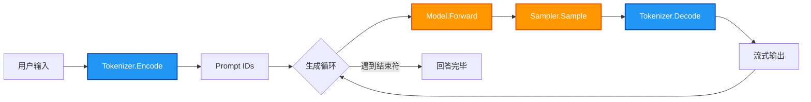

# 第 10 章：推理循环 —— 跑通端到端对话

前面的章节分别实现了模型的各个组件，但都是"一次前向"——给定 Token IDs，拿到 logits 就结束了。实际上大模型的推理是一个**循环**：每次只生成一个 token，拼回去再跑下一次，直到吐出结束符。

这一章，我们把所有零件串起来，写出第一个能对话的 Qwen3 程序。

---

## 10.1 推理流程总览

从用户输入到模型输出的完整链路：



**核心循环**：每次前向拿到 logits 后，只取概率最高的那个 token，拼到已生成的序列后面，再送入模型做下一次前向。这个过程叫**自回归（Autoregressive）**。

之前我们写的是 `model.Forward({1, 2, 3})`，一次传入所有 token。现在我们把每次预测出的 token 追加进去：

```
第 1 步: model.Forward([prompt_ids])           → next_id = 45
第 2 步: model.Forward([prompt_ids, 45])       → next_id = 102
第 3 步: model.Forward([prompt_ids, 45, 102])  → next_id = 789
...
第 N 步: next_id == <|im_end|>                 → 停止
```

---

## 10.2 采样器（Sampler）

Model.Forward 返回 logits，shape 为 `[seq_len, vocab_size]`。**只需要最后一行**（最新生成的那个位置），从中挑出概率最大的 token。

```cpp
class Sampler {
public:
    uint32_t Sample(Tensor& logits) {
        size_t seq_len   = logits.shape()[0];
        size_t vocab_size = logits.shape()[1];

        // 定位到最后一行
        float* data = logits.data<float>()
                    + (seq_len - 1) * vocab_size;

        // 贪婪采样：找最大值
        uint32_t best_token = 0;
        float max_val = -std::numeric_limits<float>::infinity();
        for (size_t i = 0; i < vocab_size; ++i) {
            if (data[i] > max_val) {
                max_val = data[i];
                best_token = i;
            }
        }
        return best_token;
    }
};
```

这就是**贪婪采样（Greedy Sampling）**——每步都选概率最高的词。优点是最简单，缺点是生成结果比较单一。更高级的采样（temperature、top-p、top-k）在此基础上加随机性和截断即可，但原理相同。

**为什么取最后一行？**

logits 的每一行对应序列中一个位置的预测。最后一行是"基于当前所有上文，下一个 token 的概率分布"——这正是我们要的。

```
logits:
  第 0 行: P(token | [prompt_0])
  第 1 行: P(token | [prompt_0, prompt_1])
  ...
  最后一行: P(token | 完整序列)  ← 取这一行
```

---

## 10.3 生成循环

### 10.3.1 最简版本

```cpp
std::string Generate(Qwen3Model& model, Tokenizer& tokenizer,
                     const std::string& prompt, size_t max_tokens) {
    // 1. 编码 prompt
    std::vector<uint32_t> ids = tokenizer.Encode(prompt);

    Sampler sampler;
    std::string output;

    for (size_t step = 0; step < max_tokens; ++step) {
        // 2. 前向传播
        Tensor logits = model.Forward(ids);

        // 3. 采样下一个 token
        uint32_t next_id = sampler.Sample(logits);

        // 4. 拼到序列后面
        ids.push_back(next_id);

        // 5. 解码并输出
        std::string piece = tokenizer.Decode({next_id});
        output += piece;
        std::cout << piece << std::flush;

        // 6. 遇到结束符则停止
        if (next_id == im_end_id) break;
    }

    return output;
}
```

### 10.3.2 完整版本（带停止判断）

Qwen3 的 `<|im_end|>` 可能被分割成多个 token。实际代码会额外检查字符串中是否出现了该标记：

```cpp
std::string GenerateReply(Qwen3Model& model, Tokenizer& tokenizer,
                          const std::string& prompt,
                          size_t max_tokens) {
    std::vector<uint32_t> ids = tokenizer.Encode(prompt);
    std::vector<uint32_t> generated;

    Sampler sampler;
    std::string reply;

    std::cout << std::endl << "Assistant: " << std::endl;

    for (size_t step = 0; step < max_tokens; ++step) {
        // 把原始 prompt + 已生成的 token 拼在一起送入模型
        std::vector<uint32_t> input_ids;
        input_ids.insert(input_ids.end(), ids.begin(), ids.end());
        input_ids.insert(input_ids.end(), generated.begin(), generated.end());

        Tensor logits = model.Forward(input_ids);

        uint32_t next_id = sampler.Sample(logits);
        generated.push_back(next_id);

        std::string piece = tokenizer.Decode({next_id});
        reply += piece;
        std::cout << piece << std::flush;

        // 通过字符串匹配判断是否结束
        if (reply.find("<|im_end|>") != std::string::npos) {
            break;
        }
    }
    std::cout << std::endl;
    return reply;
}
```

**性能提醒**：注意每次循环都重建了 `input_ids = prompt + generated`，这意味着前面的 token 被重复计算了。这是故意的——为了代码清晰。第 11 章的 KV Cache 会解决这个问题。

---

## 10.4 Chat 模板

大模型不是直接把用户输入喂进去的，而是按约定格式包装成 **prompt**。Qwen3 使用 ChatML 风格：

```
<|im_start|>system
You are a helpful assistant.<|im_end|>
<|im_start|>user
你好<|im_end|>
<|im_start|>assistant
```

代码实现：

```cpp
struct ChatMessage {
    std::string role;     // "system" / "user" / "assistant"
    std::string content;  // 对话内容
};

std::string BuildPrompt(const std::vector<ChatMessage>& messages,
                        bool add_generation_prompt) {
    std::string prompt;
    for (const auto& msg : messages) {
        prompt += "<|im_start|>" + msg.role + "\n";
        prompt += msg.content;
        prompt += "<|im_end|>\n";
    }
    // 在末尾加上 assistant 标记，提示模型开始生成
    if (add_generation_prompt) {
        prompt += "<|im_start|>assistant\n";
    }
    return prompt;
}
```

**示例**：两轮对话的 prompt 构造过程

```
消息列表:
  {system, "You are a helpful assistant."}
  {user, "你好"}
  {assistant, "你好！有什么可以帮你的？"}
  {user, "1+1=?"}

BuildPrompt(messages, true) 输出:
  <|im_start|>system
  You are a helpful assistant.<|im_end|>
  <|im_start|>user
  你好<|im_end|>
  <|im_start|>assistant
  你好！有什么可以帮你的？<|im_end|>
  <|im_start|>user
  1+1=?<|im_end|>
  <|im_start|>assistant
  ← 模型从这里开始生成
```

`<|im_start|>assistant\n` 告诉模型"现在轮到 assistant 说话了"，模型接着往下生成的就是回复内容。

---

## 10.5 完整 main 函数

把加载模型、构建 prompt、生成循环全部串起来：

```cpp
#include <iostream>
#include <string>
#include <vector>

#include "qwen3_model.h"
#include "tokenizer.h"

int main(int argc, char* argv[]) {
    std::string model_path    = "../../Qwen3-0.6B";
    std::string tokenizer_path = "../../Qwen3-0.6B/tokenizer.json";
    size_t max_new_tokens = 1024;

    if (argc > 1) tokenizer_path = argv[1];
    if (argc > 2) model_path = argv[2];

    // 1. 加载模型
    std::cout << "Loading model..." << std::endl;
    Qwen3Model model;
    if (!model.Load(model_path)) {
        std::cerr << "Failed to load model." << std::endl;
        return -1;
    }
    std::cout << "Model loaded." << std::endl;

    // 2. 加载分词器
    std::cout << "Loading tokenizer..." << std::endl;
    Tokenizer tokenizer;
    tokenizer.LoadConfig(tokenizer_path);
    std::cout << "Tokenizer loaded." << std::endl;

    // 3. 初始化对话历史（system prompt）
    std::vector<ChatMessage> messages = {
        {"system", "You are a helpful assistant."}
    };

    std::cout << "Commands: /clear to clear, /exit to quit"
              << std::endl;

    // 4. 交互循环
    while (true) {
        std::cout << "You: " << std::endl;
        std::string user_input;
        if (!std::getline(std::cin, user_input)) break;
        if (user_input.empty()) continue;
        if (user_input == "/exit" || user_input == "/quit") break;
        if (user_input == "/clear") {
            messages.resize(1);  // 只保留 system prompt
            std::cout << "History cleared." << std::endl;
            continue;
        }

        // 添加用户消息
        messages.push_back({"user", user_input});

        // 构建 prompt
        std::string prompt = BuildPrompt(messages, true);

        // 生成回复
        std::string reply = GenerateReply(
            model, tokenizer, prompt, max_new_tokens);

        // 添加助手消息到历史
        messages.push_back({"assistant", reply});
    }

    std::cout << "Bye!" << std::endl;
    return 0;
}
```

---

## 10.6 测试与验证

### 10.6.1 Sampler 单元测试

新建 `test/test_sampler.cpp`：

```cpp
#include <iostream>
#include "tensor.h"

// 直接内联 Sampler（不依赖 operator.hpp）
uint32_t GreedySample(Tensor& logits) {
    size_t seq_len   = logits.shape()[0];
    size_t vocab_size = logits.shape()[1];
    float* data = logits.data<float>()
                + (seq_len - 1) * vocab_size;

    uint32_t best = 0;
    float max_val = data[0];
    for (size_t i = 1; i < vocab_size; ++i) {
        if (data[i] > max_val) {
            max_val = data[i];
            best = i;
        }
    }
    return best;
}

int main() {
    std::cout << "=== 测试 Sampler（贪婪采样）===" << std::endl;
    std::cout << std::endl;

    // seq_len=2, vocab_size=5
    Tensor logits({2, 5}, sizeof(float));
    float* d = logits.data<float>();

    // 第 0 行: [0.1, 0.2, 0.9, 0.3, 0.1] → 最大是 token 2
    d[0]=0.1f; d[1]=0.2f; d[2]=0.9f; d[3]=0.3f; d[4]=0.1f;
    // 第 1 行: [0.05, 0.1, 0.15, 0.6, 0.1] → 最大是 token 3
    d[5]=0.05f; d[6]=0.1f; d[7]=0.15f; d[8]=0.6f; d[9]=0.1f;

    uint32_t result = GreedySample(logits);
    std::cout << "最后一行最大值在 index " << result << std::endl;
    std::cout << "(预期: 3)" << std::endl;

    std::cout << std::endl;
    std::cout << "=== 测试 2：全相同值 ===" << std::endl;
    Tensor logits2({1, 4}, sizeof(float));
    float* d2 = logits2.data<float>();
    d2[0]=0.5f; d2[1]=0.5f; d2[2]=0.5f; d2[3]=0.5f;

    uint32_t result2 = GreedySample(logits2);
    std::cout << "全相同值时选 index " << result2 << std::endl;
    std::cout << "(预期: 0，取第一个最大值)" << std::endl;

    std::cout << std::endl << "所有测试完成！" << std::endl;
    return 0;
}
```

### 10.6.2 Prompt 构造测试

新建 `test/test_prompt.cpp`：

```cpp
#include <iostream>
#include <string>
#include <vector>

struct ChatMessage {
    std::string role;
    std::string content;
};

std::string BuildPrompt(const std::vector<ChatMessage>& messages,
                        bool add_generation_prompt) {
    std::string prompt;
    for (const auto& msg : messages) {
        prompt += "<|im_start|>" + msg.role + "\n";
        prompt += msg.content;
        prompt += "<|im_end|>\n";
    }
    if (add_generation_prompt) {
        prompt += "<|im_start|>assistant\n";
    }
    return prompt;
}

int main() {
    std::vector<ChatMessage> messages = {
        {"system", "You are a helpful assistant."},
        {"user", "你好"}
    };

    std::string prompt = BuildPrompt(messages, true);

    std::cout << "=== 构造的 Prompt ===" << std::endl;
    std::cout << prompt << std::endl;
    std::cout << "---" << std::endl;
    std::cout << std::endl;

    // 验证关键标记
    bool has_im_start = prompt.find("<|im_start|>") != std::string::npos;
    bool has_im_end   = prompt.find("<|im_end|>") != std::string::npos;
    bool ends_with_assistant =
        prompt.rfind("<|im_start|>assistant\n") == prompt.size() - 20;

    std::cout << "包含 <|im_start|>: "
              << (has_im_start ? "PASS" : "FAIL") << std::endl;
    std::cout << "包含 <|im_end|>:   "
              << (has_im_end   ? "PASS" : "FAIL") << std::endl;
    std::cout << "末尾是 assistant 标记: "
              << (ends_with_assistant ? "PASS" : "FAIL") << std::endl;

    return 0;
}
```

### 10.6.3 完整端到端测试

新建 `test/test_chat.cpp`（需要模型文件）：

```cpp
#include <iostream>
#include "qwen3_model.h"
#include "tokenizer.h"

int main(int argc, char* argv[]) {
    std::string model_path = "../../Qwen3-0.6B";
    if (argc > 1) model_path = argv[1];

    std::cout << "Loading model..." << std::endl;
    Qwen3Model model;
    if (!model.Load(model_path)) {
        std::cerr << "Failed to load model." << std::endl;
        return -1;
    }

    Tokenizer tokenizer;
    tokenizer.LoadConfig(model_path + "/tokenizer.json");

    Sampler sampler;

    // 测试几个 prompt，每个生成 5 个 token
    std::vector<std::string> prompts = {
        "hello ",
        "1+1=",
    };

    for (const auto& text : prompts) {
        std::cout << "Prompt: " << text << std::endl;

        std::vector<uint32_t> ids = tokenizer.Encode(text);
        model.ClearCache();

        std::cout << "Generated: ";
        for (int step = 0; step < 5; ++step) {
            Tensor logits = model.Forward(ids);
            uint32_t next = sampler.Sample(logits);
            ids.push_back(next);
            std::cout << tokenizer.Decode({next}) << std::flush;
        }
        std::cout << std::endl << std::endl;
    }

    std::cout << "Test passed!" << std::endl;
    return 0;
}
```

### 10.6.4 更新 CMakeLists.txt

```cmake
# Sampler 测试
add_executable(test_sampler test/test_sampler.cpp)
target_include_directories(test_sampler PRIVATE
    ${CMAKE_CURRENT_SOURCE_DIR}/src)
target_link_libraries(test_sampler PRIVATE Boost::regex)

# Prompt 测试
add_executable(test_prompt test/test_prompt.cpp)

# 端到端测试（需要模型文件）
add_executable(test_chat test/test_chat.cpp)
target_include_directories(test_chat PRIVATE
    ${CMAKE_CURRENT_SOURCE_DIR}/src
    ${CMAKE_CURRENT_SOURCE_DIR}/thirdparty)
target_link_libraries(test_chat PRIVATE Boost::regex)
```

### 10.6.5 编译运行

```bash
cd build
cmake ..
make test_sampler test_prompt
./test_sampler
./test_prompt

# 完整对话测试（需要 Qwen3-0.6B 权重）：
make test_chat
./test_chat ../../Qwen3-0.6B
```

---

## 10.7 小结

本章用不到 100 行核心代码，把之前 9 章的所有组件串成一个可对话的程序：

1. **Sampler**：从 logits 最后一行取 argmax，贪婪采样一个 token
2. **生成循环**：每次前向得到一个 token → 拼回序列 → 再前向 → 直到结束
3. **Chat 模板**：`<|im_start|>role\ncontent<|im_end|>` 格式包装多轮对话
4. **main 函数**：加载模型 + 分词器 → 交互循环 → 输出回复

**到此为止，一个完整的 Qwen3 推理引擎已经可以跑了！**

唯一的遗憾是性能——每次前向都要重新计算所有历史 token 的 Attention，序列越长越慢。下一章，我们来实现 **KV Cache**，消除这个重复计算，让推理速度大幅提升。
