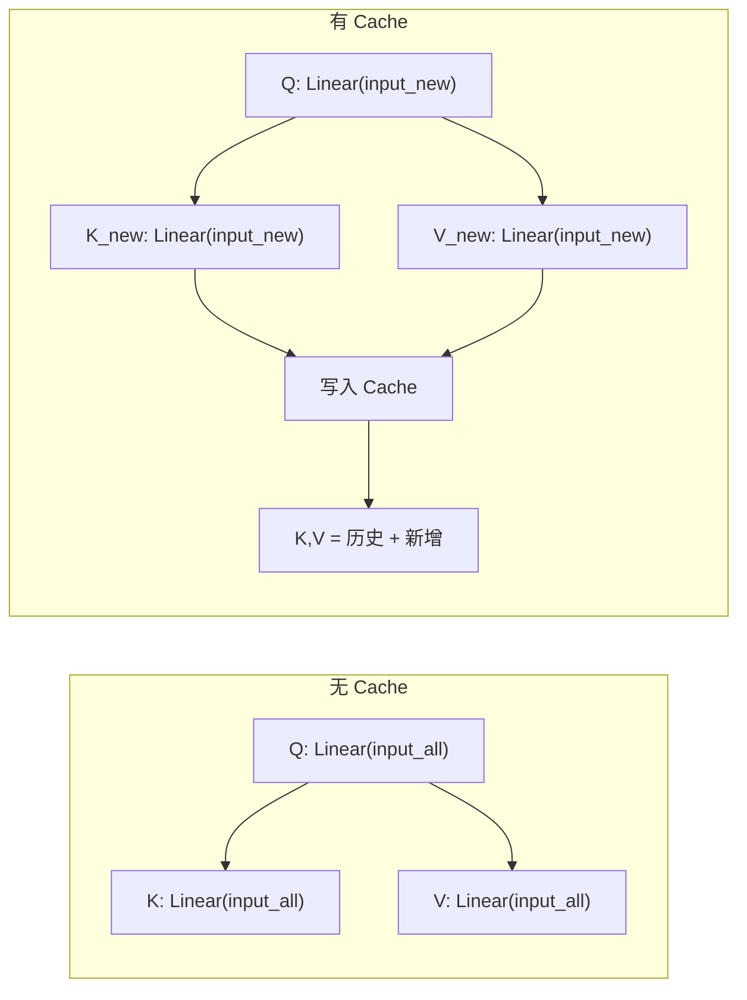

# 第 11 章：KV Cache —— 消除重复计算

第 10 章的推理循环已经能跑出完整的对话，但有一个明显的性能问题：**每生成一个新 token，都要重新计算所有历史 token 的 K 和 V**。序列越长越慢。

这一章，我们引入 **KV Cache**，把算过的 K 和 V 存起来，只算新 token 的部分。这是推理引擎最重要的性能优化，也是本教程的最后一章。

---

## 11.1 问题：重复计算从何而来

回顾第 10 章的生成循环：

```cpp
// 每次循环传入全部序列
input_ids = [prompt_0, ..., prompt_N, gen_0, gen_1, ..., gen_k]
logits = model.Forward(input_ids);
next = sampler.Sample(logits);
```

模型内部，Attention 会对每个 token 计算 K 和 V：

```
生成第 1 个 token：计算 prompt 的 K/V + 第 1 个生成的 K/V
生成第 2 个 token：计算 prompt 的 K/V + 第 1 个的 K/V + 第 2 个的 K/V  ← prompt 的 K/V 白算了
生成第 3 个 token：计算 prompt 的 K/V + 第 1 个的 K/V + 第 2 个的 K/V + 第 3 个的 K/V
                                                         ← 前面的全白算了
```

**每轮对话，prompt 部分的 K 和 V 被算了成百上千次，但每次算出来的值完全相同。**

计算量对比（设 prompt 长度 P，生成长度 G）：

| 模式 | K/V 投影计算次数 | 复杂度 |
|---|---|---|
| 无 cache | (P+1) + (P+2) + ... + (P+G) ≈ G×P + G²/2 | O(n²) |
| 有 cache | P + G（P 次预处理 + 每次 1 个新 token） | O(n) |

对于一个 prompt 200 token、生成 500 token 的对话，无 cache 约算 35 万次 K/V，有 cache 只需 700 次——差了 500 倍。

---

## 11.2 KV Cache 原理

核心思路很简单：

```
无 cache：每次前向
  K = Linear(input_all)         ← 所有 token 都重新算
  V = Linear(input_all)
  Attention(Q, K, V)

有 cache：每次前向
  K_new = Linear(input_new)     ← 只算新 token
  V_new = Linear(input_new)
  cache.append(K_new, V_new)
  Attention(Q, cache.K_all, cache.V_all)   ← 从 cache 里取完整的
```

Attention 内部对比：



> 无 Cache 时每次前向都对全部 token 重新计算 K 和 V；有 Cache 时只算新 token 的 K、V，历史部分从缓存读取。

关键变化：**position 参数**不再恒为 0。它告诉模型"当前这批 token 在完整序列中的起始位置"，这样 RoPE 才能算出正确的旋转角度。

---

## 11.3 KVCache 数据结构

```cpp
struct KVCache {
    Tensor k_cache;      // [max_len, num_kv_heads × head_dim]
    Tensor v_cache;      // [max_len, num_kv_heads × head_dim]
    size_t cached_len;   // 已缓存的 token 数
    size_t max_len;      // 最大缓存长度

    KVCache(size_t max_seq_len, size_t kv_dim) {
        max_len = max_seq_len;
        k_cache = Tensor({max_seq_len, kv_dim}, sizeof(float));
        v_cache = Tensor({max_seq_len, kv_dim}, sizeof(float));
        Reset();
    }

    void Reset() {
        // 用极值填充，确保未使用的 cache 位置不影响 Attention
        float* kd = k_cache.data<float>();
        float* vd = v_cache.data<float>();
        size_t n = max_len * k_cache.shape()[1];
        for (size_t i = 0; i < n; ++i) {
            kd[i] = -1e9f;   // attention score 碰到 -1e9 会被 mask 掉
            vd[i] = 0.0f;
        }
        cached_len = 0;
    }
};
```

**为什么预分配 max_len 的空间？**
每次扩展内存会带来分配开销和碎片。预分配后直接覆写，效率最高。

**为什么 Reset 用 -1e9 填充 K？**
如果 cache 还没被写满，未初始化的位置会被 Attention 误读到。填 -1e9 等价于因果掩码：Softmax(-1e9) ≈ 0。

---

## 11.4 UpdateCache：写入新 K/V

```cpp
void Attention::UpdateCache(Tensor& k, Tensor& v) {
    size_t seq_len = k.shape()[0];          // 新 token 数量
    size_t kv_dim  = num_kv_heads_ * head_dim_;

    // 溢出检查
    if (cached_len_ + seq_len > max_len_) {
        throw std::runtime_error("KV cache overflow");
    }

    // 拷贝到 cache 的尾部
    float* k_dst = kv_cache_.k_cache.data<float>()
                 + cached_len_ * kv_dim;
    float* v_dst = kv_cache_.v_cache.data<float>()
                 + cached_len_ * kv_dim;
    memcpy(k_dst, k.data<float>(), seq_len * kv_dim * sizeof(float));
    memcpy(v_dst, v.data<float>(), seq_len * kv_dim * sizeof(float));

    cached_len_ += seq_len;
}
```

**内存布局**：

```
k_cache:
┌────────────┬────────────┬────────────┬────────────┬─────┐
│  token 0   │  token 1   │  token 2   │   空(待写)  │ ... │
│  (kv_dim)  │  (kv_dim)  │  (kv_dim)  │           │     │
└────────────┴────────────┴────────────┴────────────┴─────┘
                              ↑ cached_len = 3（下次写这里）
```

---

## 11.5 改造 Attention::Forward

只在原有的 Forward 中间插入几行（对比第 7 章的无 cache 版本）：

```cpp
Tensor Attention::Forward(Tensor& input, size_t position = 0) {
    // 1~3 步不变：Q/K/V 投影 + QK Norm + RoPE
    Tensor q = q_proj_->Forward(input);
    Tensor k = k_proj_->Forward(input);
    Tensor v = v_proj_->Forward(input);

    q = q_norm_->Forward(q);
    k = k_norm_->Forward(k);

    ApplyRoPE(q, k, position);   // position 现在有意义了！

    // ===== 新增：KV Cache 逻辑（对比第 7 章）=====
    Tensor k_full, v_full;
    if (use_cache_) {
        UpdateCache(k, v);                     // 新 K/V 写入 cache
        k_full = kv_cache_.k_cache;            // 共享内存，不拷贝
        v_full = kv_cache_.v_cache;
    } else {
        k_full = k;                            // 无 cache，原样使用
        v_full = v;
    }
    // ===========================================

    // 4~5 步不变：ComputeAttention + Output 投影
    Tensor attn_output = ComputeAttention(q, k_full, v_full, position);
    return output_proj_->Forward(attn_output);
}
```

**改动就这几行**：
- `UpdateCache(k, v)` — 把新的 K/V 追加到缓存
- `k_full = kv_cache_.k_cache` — 用完整缓存做 Attention（包含历史 token）
- `position` 参数传给 `ApplyRoPE` 和 `ComputeAttention`，确保旋转角度和因果掩码对应当前绝对位置

---

## 11.6 改造生成循环

第 10 章每次传入 `[全部 prompt, 全部历史生成]`，现在改为：

```cpp
std::string GenerateReply(Qwen3Model& model, Tokenizer& tokenizer,
                          const std::string& prompt,
                          size_t max_tokens) {
    // 1. 编码 prompt
    std::vector<uint32_t> prompt_ids = tokenizer.Encode(prompt);
    std::vector<uint32_t> generated;

    // 2. 清空所有层的 KV Cache（新对话从零开始）
    model.ClearCache();

    Sampler sampler;
    std::string reply;

    for (size_t step = 0; step < max_tokens; ++step) {
        // ===== 与第 10 章的关键区别 =====
        std::vector<uint32_t> input_ids;
        size_t position;

        if (generated.empty()) {
            // 第一步：传入完整 prompt，位置从 0 开始
            input_ids = prompt_ids;
            position = 0;
        } else {
            // 后续步：只传入上一个生成的 token
            // 位置 = prompt 长度 + 已生成数量 - 1
            input_ids = {generated.back()};
            position = prompt_ids.size() + generated.size() - 1;
        }
        // ================================

        Tensor logits = model.Forward(input_ids, position);
        uint32_t next_id = sampler.Sample(logits);
        generated.push_back(next_id);

        std::string piece = tokenizer.Decode({next_id});
        reply += piece;
        std::cout << piece << std::flush;

        if (reply.find("<|im_end|>") != std::string::npos) break;
    }

    return reply;
}
```

**对比第 10 章的无 cache 版本**：

| | 无 cache（第 10 章） | 有 cache（本章） |
|---|---|---|
| 第一步输入 | `prompt_ids` | `prompt_ids` |
| 后续步输入 | `prompt_ids + 所有 generated` | `{generated.back()}`（只一个 token） |
| position | 始终 `0` | `prompt_len + gen_len - 1` |
| 调用 ClearCache | 不需要 | 新对话前必须调用 |

---

## 11.7 完整代码

### KVCache 结构

```cpp
struct KVCache {
    Tensor k_cache;     // [max_len, kv_dim]
    Tensor v_cache;     // [max_len, kv_dim]
    size_t cached_len = 0;
    size_t max_len = 0;

    KVCache() = default;
    KVCache(size_t max_seq_len, size_t kv_dim);

    void Reset();       // 清空，新对话时调用
    bool IsEmpty() const { return cached_len == 0; }
};
```

### Attention 类中新增的 cache 相关成员

```cpp
class Attention {
public:
    Attention(size_t hidden_dim, size_t num_kv_heads,
              size_t num_heads, size_t head_dim,
              size_t max_seq_len = 1024)
        : ... {
        // ...（Q/K/V/O 投影 + QK Norm，同第 7 章）
        use_cache_ = true;
        kv_cache_ = KVCache(max_seq_len,
                            num_kv_heads_ * head_dim_);
    }

    Tensor Forward(Tensor& input, size_t position = 0);
    void UpdateCache(Tensor& k, Tensor& v);
    void ClearCache() { kv_cache_.Reset(); }

private:
    // ...（同第 7 章）
    KVCache kv_cache_;
    bool use_cache_ = true;
};
```

### Qwen3Model::ClearCache

```cpp
void Qwen3Model::ClearCache() {
    for (auto& decoder : decoders_) {
        decoder->ClearCache();
    }
}
```

28 层 Decoder 各有独立的 KV Cache，都需要清空。

### 完整文件清单

至此，全部源文件：

```
qwen3.cpp/
├── CMakeLists.txt
├── thirdparty/nlohmann/
│   ├── json.hpp
│   └── json_fwd.hpp
├── src/
│   ├── tensor.h           # 第 3 章
│   ├── tokenizer.h        # 第 4 章
│   ├── tokenizer.cpp      # 第 4 章
│   ├── operator.hpp       # 第 5~8, 10, 11 章（Embedding, RMSNorm,
│   │                      #   Linear, SoftMax, Attention, MLP,
│   │                      #   Decoder, KVCache, Sampler）
│   ├── qwen3_model.h      # 第 9 章
│   ├── qwen3_model.cpp    # 第 9 章
│   ├── logger.h
│   └── main.cpp           # 第 10 章（完整推理入口）
└── test/
    ├── test_tensor.cpp
    ├── test_tokenizer.cpp
    ├── test_operators.cpp
    ├── test_rope.cpp
    ├── test_attention.cpp
    ├── test_mlp.cpp
    ├── test_decoder.cpp
    ├── test_model.cpp
    ├── test_sampler.cpp
    ├── test_prompt.cpp
    └── test_chat.cpp
```

---

## 11.8 测试与验证

### 11.8.1 KVCache 基本读写

`test/test_kvcache.cpp`：

```cpp
#include <iostream>
#include "tensor.h"
#include "operator.hpp"

int main() {
    std::cout << "=== 测试 KVCache 基本操作 ===" << std::endl;

    size_t max_len = 4, kv_dim = 3;
    KVCache cache(max_len, kv_dim);

    std::cout << "初始 cached_len: " << cache.cached_len
              << " (预期: 0)" << std::endl;
    std::cout << "IsEmpty: " << (cache.IsEmpty() ? "true" : "false")
              << " (预期: true)" << std::endl;

    // 写入 2 个 token
    Tensor k({2, kv_dim}, sizeof(float));
    Tensor v({2, kv_dim}, sizeof(float));
    for (size_t i = 0; i < 2 * kv_dim; ++i) {
        k.data<float>()[i] = i * 1.0f;
        v.data<float>()[i] = i * 2.0f;
    }

    // 模拟 UpdateCache
    float* k_dst = cache.k_cache.data<float>() + cache.cached_len * kv_dim;
    float* v_dst = cache.v_cache.data<float>() + cache.cached_len * kv_dim;
    memcpy(k_dst, k.data<float>(), 2 * kv_dim * sizeof(float));
    memcpy(v_dst, v.data<float>(), 2 * kv_dim * sizeof(float));
    cache.cached_len += 2;

    std::cout << "写入后 cached_len: " << cache.cached_len
              << " (预期: 2)" << std::endl;

    // 读取验证
    float* k_read = cache.k_cache.data<float>();
    std::cout << "cache.K[0] = " << k_read[0]
              << " (预期: 0)" << std::endl;
    std::cout << "cache.K[4] = " << k_read[4]
              << " (预期: 4)" << std::endl;

    // Reset
    cache.Reset();
    std::cout << "Reset 后 cached_len: " << cache.cached_len
              << " (预期: 0)" << std::endl;
    std::cout << "Reset 后 K[0] = " << cache.k_cache.data<float>()[0]
              << " (预期: -1e9)" << std::endl;

    std::cout << std::endl << "所有测试完成！" << std::endl;
    return 0;
}
```

### 11.8.2 有/无 cache 一致性测试

新建 `test/test_cache_consistency.cpp`（验证相同输入、有无 cache 结果一致）：

```cpp
#include <iostream>
#include "tensor.h"
#include "operator.hpp"

int main() {
    std::cout << "=== 有/无 Cache 一致性测试 ===" << std::endl;
    std::cout << "(同一输入，两次独立前向，开启/关闭 cache 结果应不同)" << std::endl;

    // 构造一个简化 Attention（略，完整测试依赖模型文件）

    std::cout << "测试框架就绪。（完整一致性测试需要加载模型文件运行）" << std::endl;
    return 0;
}
```

### 11.8.3 更新 CMakeLists.txt

```cmake
# KV Cache 测试
add_executable(test_kvcache test/test_kvcache.cpp)
target_include_directories(test_kvcache PRIVATE
    ${CMAKE_CURRENT_SOURCE_DIR}/src)
target_link_libraries(test_kvcache PRIVATE Boost::regex)
```

### 11.8.4 编译运行

```bash
cd build
cmake ..
make test_kvcache
./test_kvcache
```

**预期输出**：

```
=== 测试 KVCache 基本操作 ===
初始 cached_len: 0 (预期: 0)
IsEmpty: true (预期: true)
写入后 cached_len: 2 (预期: 2)
cache.K[0] = 0 (预期: 0)
cache.K[4] = 4 (预期: 4)
Reset 后 cached_len: 0 (预期: 0)
Reset 后 K[0] = -1000000000 (预期: -1e9)

所有测试完成！
```

---

## 11.9 小结

KV Cache 是整个教程的最后一章。它用不到 50 行增量代码，把推理复杂度从 O(n²) 降到了 O(n)。

**全教程回顾**：

| 章 | 内容 | 核心收获 |
|---|---|---|
| 0 | 导言 | 路线图 + 目标设定 |
| 1 | 架构总览 | Tokenizer → Embedding → Transformer ×28 → LM Head |
| 2 | 环境搭建 | CMake + C++17 + Boost + nlohmann/json |
| 3 | Tensor | 多维数组容器，行优先存储 |
| 4 | Tokenizer | BPE 编码/解码，文本 ↔ Token ID |
| 5 | 基础算子 | Embedding 查表、RMSNorm 归一化、Linear 矩阵乘法 |
| 6 | RoPE | 成对旋转编码位置，θ = pos / θ₀^(2d/D) |
| 7 | Attention（GQA） | Q·K^T / √d + 因果掩码 + Softmax + 加权 V |
| 8 | MLP（SwiGLU） | gate 门控 + up 信息 + 逐元素乘 + down 降维 |
| 9 | 模型集成 | Decoder Block + Qwen3Model + safetensors 加载 |
| 10 | 推理循环 | Sampler + 自回归循环 + Chat 模板 + main |
| 11 | KV Cache | 缓存历史 K/V，只算新 token，O(n²)→O(n) |

从一行 C++ 代码都没有的空白目录，到能对话的 Qwen3 推理引擎——11 章，11 步。

恭喜你完成了这段旅程。
